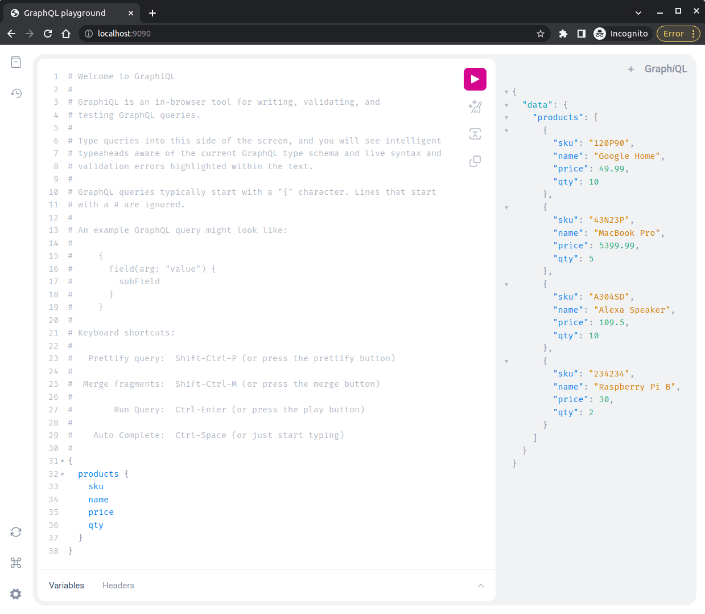

# Simple e-Commerce App
This project repository demonstrates a customer perspective to experience simple purchase activity on a e-commerce system.

## Contents
1. [Introduction](#introduction)
   * [Problem Statement](#problem-statement)
   * [Objective](#objective)
2. [Overview](#overview)
   * [Application Flow](#application-flow)
3. [Getting Started](#getting-started)
   * [Prerequisites](#prerequisites)
   * [Build](#build)
   * [Run](#run)
4. [Documentation](#documentation)   
5. [Thank you](#thank-you)

## Introduction
### Problem Statement
| SKU   | Name  | Price | Inventory Qty |
| :---: | --- | ---   |          ---: |
| 120P90 | Google Home | $49.99 | 10 |
| 43N23P | MacBook Pro | $5,399.99 | 5 |
| A304SD | Alexa Speaker | $109.50 | 10 |
| 234234 | Raspberry Pi B | $30.00 | 2 |

**The system should have the following promotions:**
- Each sale of a MacBook Pro comes with a free Raspberry Pi B.
- Buy 3 Google Home for the price of 2.
- Buying more than 3 Alexa Speakers will have 10% discount on all Alexa Speakers.

### Objective
- [X] Develop a web server application to solve the problem statement using [Go](https://golang.org/doc/install) language.
- [X] Implement [GraphQL](https://graphql.org/) as API endpoint.
- [X] Implement CI to build and produce executable binary.
- [X] Implement CI to run test.

## Overview
### Application Flow
In order to perform checkout API sucessfully, following step must be executed in order. Please refer to the [Postman API Documentation](docs/POSTMAN.md) to know list of exposed API.
1. Please select predefined `User ID` to perform `Add Item to Cart` API. List of user reference: [Account Service](docs/ACCOUNT.md)
2. Please select product item and quantity to add to the cart. Please refer to the `Query - Products` API at [Postman API Documentation](docs/POSTMAN.md) to get all available products.
3. Add product item and quantity to the cart, `Add Item to Cart` API requires `User ID`, product `sku`, and product quantity `qty` as input parameter as you can retrieve at Step 1 and Step 2.
4. After product item and quantity successfully added to the cart you can perform `Checkout` API, this API requires `User ID` as input parameter.
5. After checkout cart has successfully performed, the cart will be deleted from memory. You can repeat the flow from Step 1, in addition add product quantity is available just in case you would like to simulate the promotion condition.


## Getting Started
### Prerequisites
1.  Please make sure you have [Go](https://golang.org/doc/install) installed on your system.
2.  Please make sure you have [Docker](https://docs.docker.com/engine/install/) installed on your system.

### Build
* Executes following command to build and produce linux-based executable binary
```bash
make build-binary
```

* Executes following command to build and produce docker image
```bash
make build-docker
```

* Executes following command to run test and produce code coverage report
```bash
make test
```

### Run
1. Executes following command in the root directory of project repository to run the program.
```bash
make run
```
2. Open [http://localhost:9090](http://localhost:9090) to open QraphQL browser or use [postman collection](docs/postman/postman_collection.json) to hit the API.



## Documentation
* [Account Service](docs/ACCOUNT.md)
* [Order Service](docs/ORDER.md)
* [Product Service](docs/PRODUCT.md)
* [Promotion Service](docs/PROMOTION.md)
* [Checkout API](docs/CHECKOUT.md)
* [Postman API](docs/POSTMAN.md)

## Thank You
Thank you for your consideration. 

Regards, Ahmad Ridwan Mushoffa