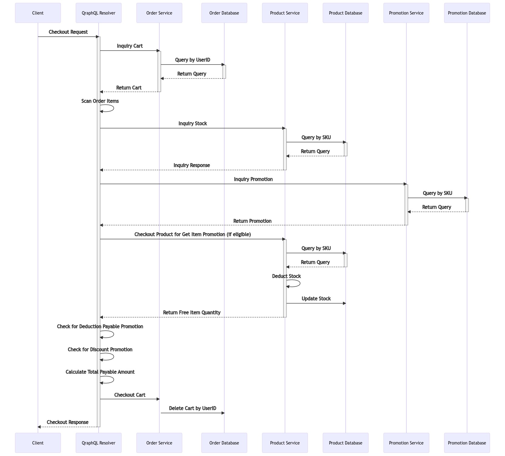
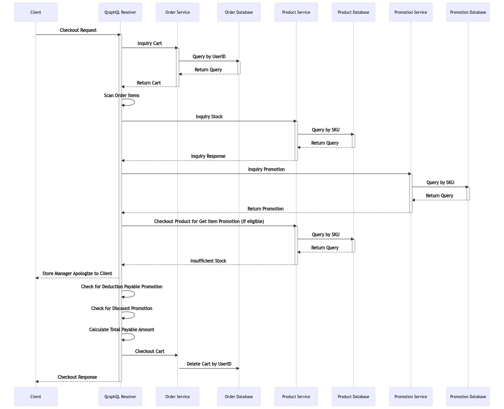
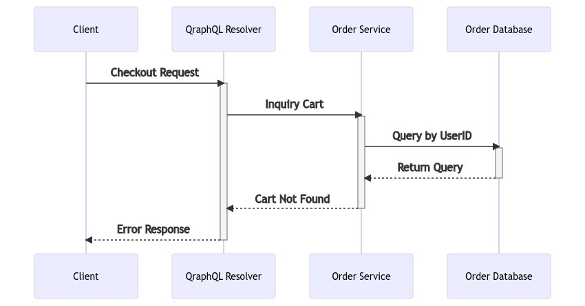
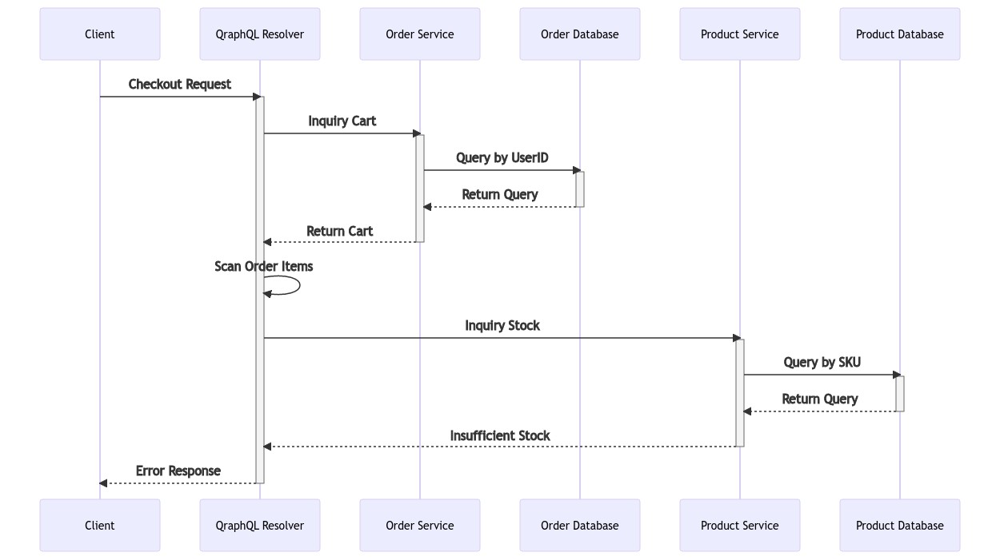

# Checkout Flow
Please add item to cart as a prerequisite condition to perform checkout process, otherwise the system will give error response. The checkout API has four usecases
1. Successfully checkout order item(s)
2. Insufficient promotion product quantity in stock (success usecase with condition)
3. No cart to checkout
4. Insufficient order item quantity in stock

## Success Checkout

## Success Checkout with Condition

## No Cart to Checkout

## Insufficient Order Item Stock
