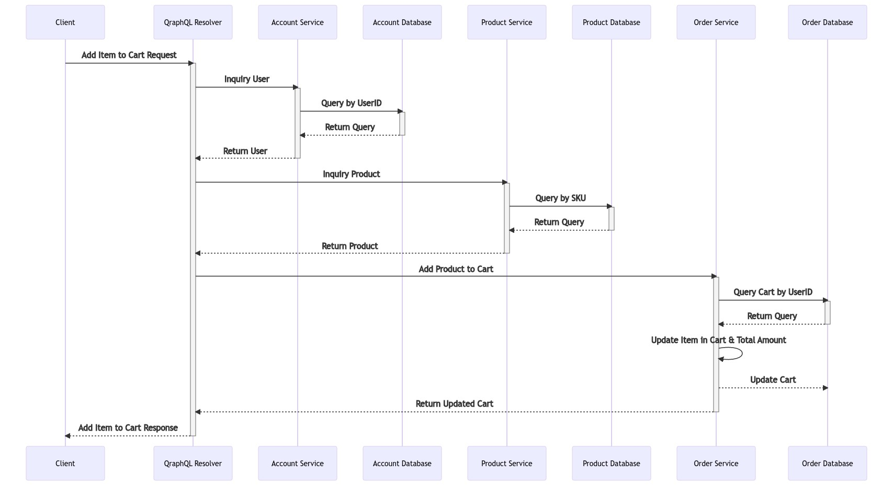
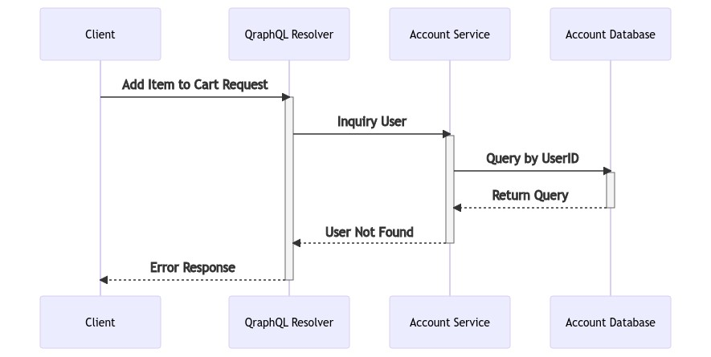
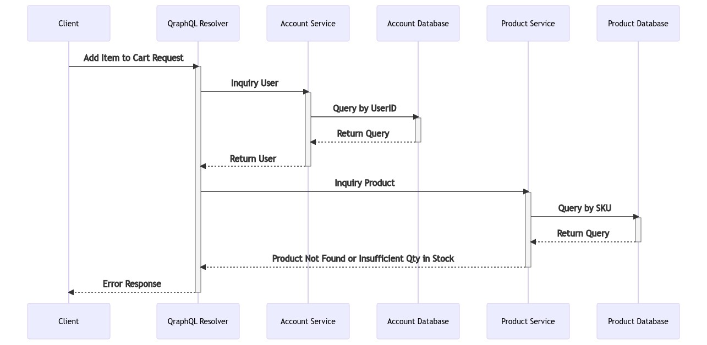

# Order Service

## Add Item to Cart
Add item to cart has four usecases
1. Add item to existing cart
2. Add item to new cart
3. Invalid user id when adding item to cart
4. Invalid product SKU or insufficient product quantity in stock

### Add Item to Existing Cart

### Add Item to New Cart

### Invalid User ID

### Invalid Product or Insufficient Product Quantity
