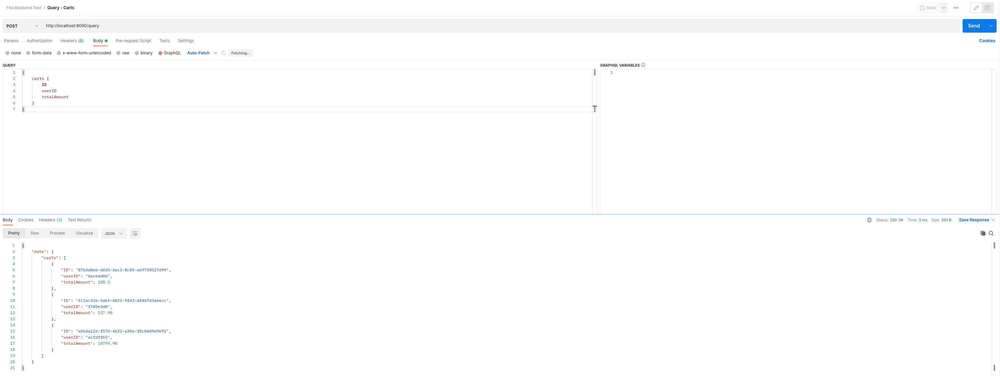
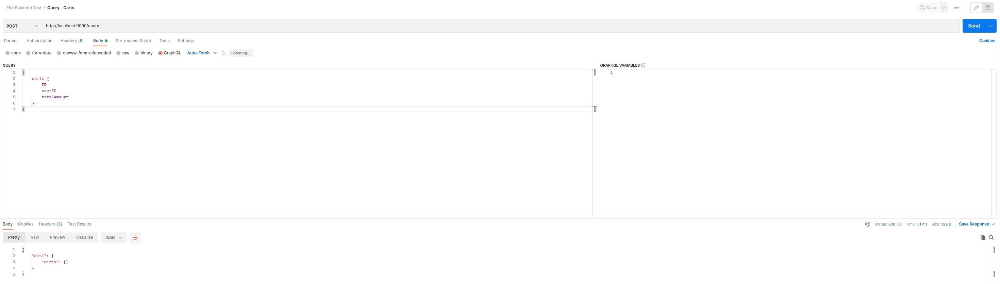
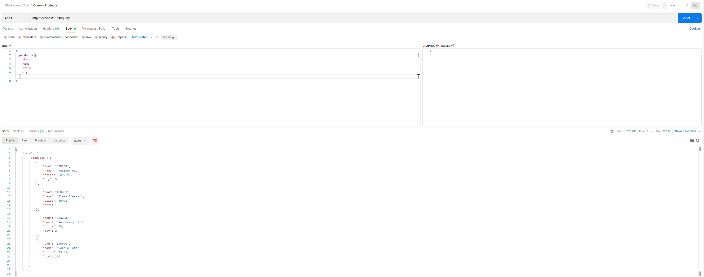
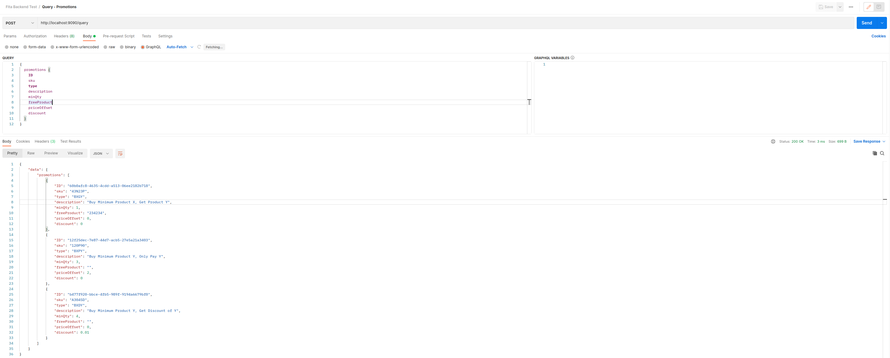
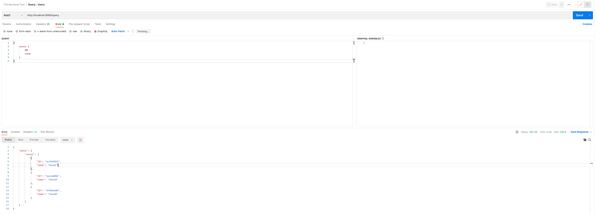
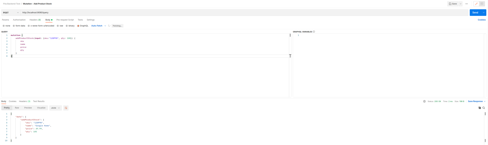
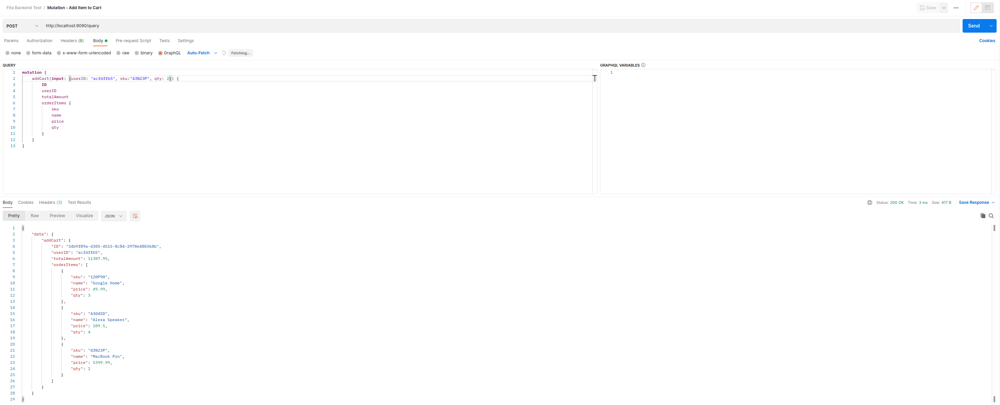
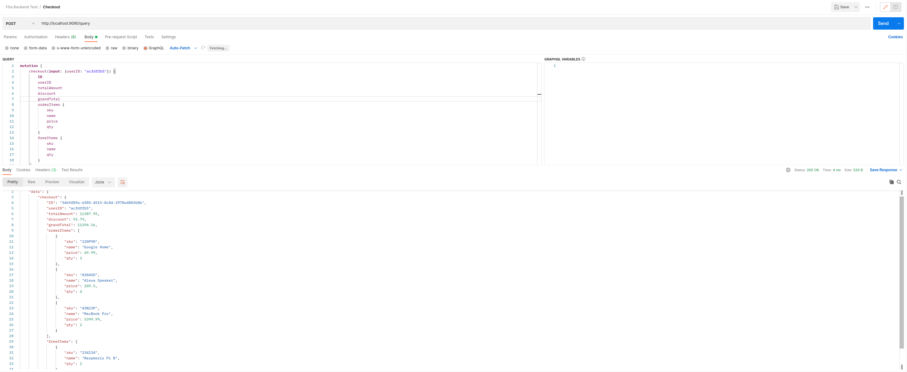

# Postman API

List API:
1. Query - Carts
2. Query - Products
3. Query - Promotions
4. Query - Users
5. Mutation - Add Product Stock
6. Mutation - Add Item to Cart
7. Mutation - Checkout

[Postman Collection](postman/postman_collection.json)

## Query - Carts

## Query - Products

## Query - Promotions

## Query - Users

## Mutation - Add Product Stock

## Mutation - Add Item to Cart

## Checkout
